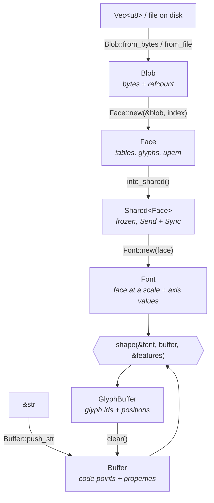

# The object model

Five types carry all the work: `Blob`, `Face`, `Font`, `Buffer`, and
`GlyphBuffer`. They stack — each one is built from the one before it — and they
differ enormously in what they cost to create. Knowing which is which is most of
what it takes to use HarfBuzz efficiently.

- [The stack](#the-stack)
- [What each type is](#what-each-type-is)
- [Costs and caching](#costs-and-caching)
- [Who keeps whom alive](#who-keeps-whom-alive)
- [A cache that works](#a-cache-that-works)
- [Buffer and GlyphBuffer are one object](#buffer-and-glyphbuffer-are-one-object)

---

## The stack



As plain text, with the direction of ownership marked:

```text
  Blob  ──owned by──►  Face  ──owned by──►  Font
  (bytes)              (tables)             (scale, axes)
                                              │
                                              │  shape(&font, buffer, &[])
                                              ▼
                     Buffer  ─────────────►  GlyphBuffer
                  (code points)              (glyphs + positions)
                       ▲                          │
                       └──────── clear() ─────────┘
```

## What each type is

### `Blob`

A chunk of bytes with a lifetime HarfBuzz can track. Rather than take a raw
pointer and hope it outlives everything built from it, HarfBuzz wraps bytes in a
reference-counted object and releases them through a callback when the last
reference goes.

```rust
use harfbuzz_rs::Blob;

fn main() -> harfbuzz_rs::Result<()> {
    let blob = Blob::from_file("collection.ttc")?;

    println!("{} bytes, {} faces", blob.len(), blob.face_count());
    println!("first four bytes: {:?}", &blob.as_bytes()[..4]);
    Ok(())
}
```

| Method | Signature | Notes |
| --- | --- | --- |
| `Blob::from_bytes` | `(impl Into<Arc<[u8]>>) -> Result<Blob>` | Moves the allocation into HarfBuzz; **no copy**. Accepts `Vec<u8>`, `Box<[u8]>`, `Arc<[u8]>`. The `Arc` is released when the last blob reference dies. |
| `Blob::from_file` | `(impl AsRef<Path>) -> Result<Blob>` | Memory-maps where the platform allows. Fails with `Error::FontLoadFailed` if the path cannot be read. |
| `as_bytes` | `(&self) -> &[u8]` | Borrowed for as long as the blob. |
| `len` / `is_empty` | `(&self) -> usize` / `bool` | Byte count. |
| `face_count` | `(&self) -> u32` | `1` for a plain `.ttf`, more for a `.ttc` collection. `0` means the data is not a font. |

Most programs never name a `Blob`: `Face::from_file` and `Face::from_bytes`
build one internally. Reach for it directly when you want several faces from one
collection, or when you already hold an `Arc<[u8]>` that other parts of your
program share.

### `Face`

One typeface parsed out of a blob: its tables, its glyph inventory, its design
grid. **No size.** This is the expensive object and the one to cache.

```rust
use harfbuzz_rs::{Blob, Face, Tag};

fn main() -> harfbuzz_rs::Result<()> {
    let blob = Blob::from_file("collection.ttc")?;

    // Every face in a collection, sharing one copy of the bytes.
    for index in 0..blob.face_count() {
        let face = Face::new(&blob, index)?;
        println!("face {index}: {} glyphs, upem {}", face.glyph_count(), face.upem());

        // Raw table access, by four-character tag. Missing tables come back empty.
        let is_variable = !face.table(Tag::new(b"fvar")).is_empty();
        println!("  variable: {is_variable}");
    }

    Ok(())
}
```

| Method | Signature | Notes |
| --- | --- | --- |
| `Face::new` | `(&Blob, u32) -> Result<Face>` | References the blob rather than copying it. |
| `Face::from_file` | `(impl AsRef<Path>, u32) -> Result<Face>` | Convenience over `Blob::from_file` + `new`. |
| `Face::from_bytes` | `(impl Into<Arc<[u8]>>, u32) -> Result<Face>` | Convenience over `Blob::from_bytes` + `new`. |
| `glyph_count` | `(&self) -> u32` | |
| `upem` | `(&self) -> u32` | Design units per em — what `Font::set_scale` scales *from*. |
| `index` | `(&self) -> u32` | Which face of the collection this is. |
| `blob` | `(&self) -> Blob` | The underlying data. Takes a new reference; does not copy. |
| `table` | `(&self, Tag) -> Blob` | One raw table. **Returns an empty blob for a missing table**, never an error. |
| `set_upem` | `(&mut self, u32)` | Overrides the design grid. `&mut self`, so unreachable once shared. |
| `set_glyph_count` | `(&mut self, u32)` | Only meaningful for a face being built table by table. |

### `Font`

A face pinned to a scale, a pixels-per-em, and a set of variation-axis values.
Shaping consumes a font, not a face, because positions are meaningless without a
scale.

`Font::new` takes a `Shared<Face>` **by value** and holds its own reference, so
the font keeps the face alive on its own. Clone the shared handle if you want to
build more fonts from it.

```rust
use harfbuzz_rs::{Face, Font, IntoShared, points_to_scale};

fn main() -> harfbuzz_rs::Result<()> {
    let face = Face::from_file("font.ttf", 0)?.into_shared();

    let sizes = [12, 16, 24];
    let fonts: Vec<Font> = sizes
        .iter()
        .map(|&pt| {
            let mut font = Font::new(face.clone());   // cheap: one atomic increment
            font.set_scale(points_to_scale(pt), points_to_scale(pt));
            font
        })
        .collect();

    println!("{} fonts from one face", fonts.len());
    Ok(())
}
```

The full method list is in [fonts-and-sizing.md](fonts-and-sizing.md#font-methods).

### `Buffer` and `GlyphBuffer`

The text going in, and the glyphs coming out. Covered in
[text-and-buffers.md](text-and-buffers.md); the structural point is
[below](#buffer-and-glyphbuffer-are-one-object).

## Costs and caching

| Type | Cost to create | Cost to clone | Cache it? |
| --- | --- | --- | --- |
| `Blob` | Cheap (`from_bytes` moves; `from_file` mmaps) | `Shared<Blob>`: one atomic increment | Only if you build several faces from it |
| `Face` | **Expensive** — parses the font's directory and tables | `Shared<Face>`: one atomic increment | **Yes.** One per font file, for the program's lifetime |
| `Font` | Cheap — upstream calls fonts "very light-weight objects" | `Shared<Font>`: one atomic increment | Yes, if you re-render at fixed sizes. Keyed by size and axis values |
| `Buffer` | Cheap, but allocates | Not clonable | **Reuse** rather than cache: `GlyphBuffer::clear()` returns it emptied, allocation intact |
| `GlyphBuffer` | Not created directly | Not clonable | n/a |

The rule of thumb: **parse once, size cheaply, reuse buffers.** A program that
calls `Face::from_file` inside its draw loop is doing hundreds of times more
work than one that does not.

## Who keeps whom alive

Every one of these types is a counted reference to a C object. Dropping a
wrapper decrements; the object dies at zero. Because each level takes its own
reference on the level below, you can drop the intermediate handles and the
chain stays intact:

```rust
use harfbuzz_rs::{Blob, Face, Font, IntoShared};

fn main() -> harfbuzz_rs::Result<()> {
    let font = {
        let blob = Blob::from_file("font.ttf")?;
        let face = Face::new(&blob, 0)?.into_shared();
        Font::new(face)
        // `blob` and `face` are dropped here...
    };

    // ...but the font still holds references all the way down.
    println!("{} glyphs", font.face().glyph_count());
    Ok(())
}
```

`Font::face()` reaches back down the chain and returns a `Shared<Face>` —
already frozen, because `Font::new` freezes what it is given.

Bytes handed to `Blob::from_bytes` are freed by *Rust*, through the destroy
callback HarfBuzz invokes when the blob's last reference goes. There is no way
to pair the wrong allocator with the wrong free, and no way to drop the bytes
while a face still points at them.

## A cache that works

A minimal font cache: one shared face, fonts keyed by integer size.

```rust
use std::collections::HashMap;

use harfbuzz_rs::{Face, Font, IntoShared, Shared, points_to_scale};

struct FontCache {
    face: Shared<Face>,
    by_size: HashMap<i32, Shared<Font>>,
}

impl FontCache {
    fn open(path: &str) -> harfbuzz_rs::Result<Self> {
        Ok(Self {
            face: Face::from_file(path, 0)?.into_shared(),
            by_size: HashMap::new(),
        })
    }

    /// A font at the given point size, built once and shared thereafter.
    fn at(&mut self, points: i32) -> Shared<Font> {
        self.by_size
            .entry(points)
            .or_insert_with(|| {
                let mut font = Font::new(self.face.clone());
                font.set_scale(points_to_scale(points), points_to_scale(points));
                font.into_shared()
            })
            .clone()
    }
}
```

Storing `Shared<Font>` rather than `Font` means the cached fonts are `Send` and
`Sync`, so the whole cache can sit behind an `Arc` and be shaped from any
thread. The returned handle derefs to `&Font`, which is what `shape` wants:

```rust
use harfbuzz_rs::{Font, Shared, buffer_from, shape};

fn width(font: &Shared<Font>, text: &str) -> harfbuzz_rs::Result<i32> {
    // `&Shared<Font>` coerces to `&Font` through `Deref`.
    let output = shape(font, buffer_from(text)?, &[]);
    Ok(output.positions().iter().map(|p| p.x_advance()).sum())
}
```

If your fonts differ by variation axes as well as size, key the map on both —
`(i32, [u16; N])` or a small struct. Setting variations on a shared font is not
possible by design; build a separate font per axis setting. See
[fonts-and-sizing.md](fonts-and-sizing.md#variable-fonts).

## Buffer and GlyphBuffer are one object

There is only one C buffer. Before shaping it holds Unicode code points; after
shaping the very same memory holds glyph IDs and positions. `hb_shape` rewrites
it in place — there is no separate "result" object.

That would be a trap in Rust: `info.glyph()` returns a meaningless number if
called before shaping, and `push_str` after shaping would mix code points into
glyph data. So the crate splits the one C object across two Rust types:

| Type | Holds | You can |
| --- | --- | --- |
| `Buffer` | Code points | add text, set direction/script/language, clear |
| `GlyphBuffer` | Glyphs and positions | read `infos()`, `positions()`, `iter()`, `direction()`, `clear()` |

`shape` consumes the `Buffer` and produces the `GlyphBuffer`;
`GlyphBuffer::clear()` consumes it back into a `Buffer`. Neither type can be
used in the other's phase, and neither is `Clone` — the buffer is genuinely
unique, and passing it by value is how the compiler enforces that.

```rust
use harfbuzz_rs::{Font, buffer_from, shape};

fn twice(font: &Font) -> harfbuzz_rs::Result<()> {
    let buffer = buffer_from("hello")?;

    let first = shape(font, buffer, &[]);
    // let second = shape(font, buffer, &[]);   <- does not compile: buffer moved

    let mut buffer = first.clear();
    buffer.push_str("again");
    buffer.guess_segment_properties();
    let _second = shape(font, buffer, &[]);

    Ok(())
}
```

---

Next: [ownership-and-threads.md](ownership-and-threads.md) for why the frozen
`Shared<T>` state exists at all, or
[text-and-buffers.md](text-and-buffers.md) for what to put in a buffer.

The C-level object model, including the reference-counting and user-data APIs
this crate hides, is documented in
[`../harfbuzz-sys/docs/guide/05-object-model.md`](../harfbuzz-sys/docs/guide/05-object-model.md).
